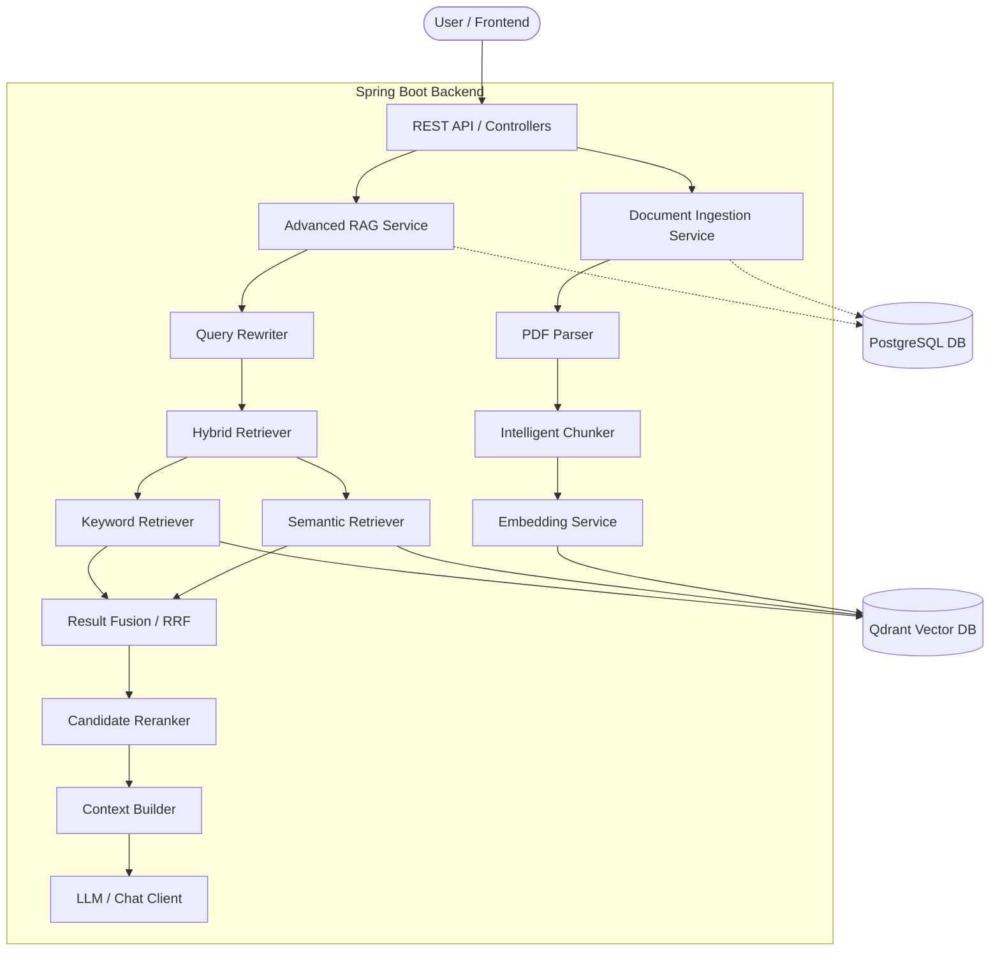
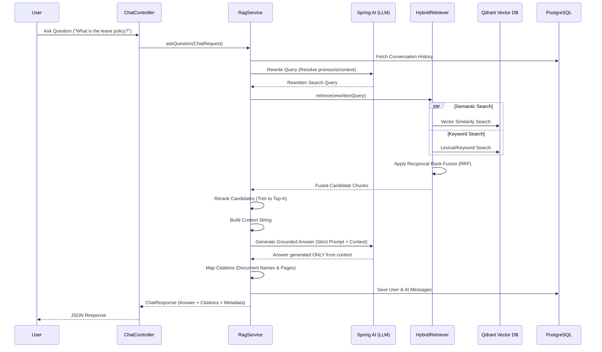

# AI Document Assistant

A clean, production-quality Document Question-Answering application demonstrating an **Advanced Retrieval-Augmented Generation (RAG)** architecture. 

This project goes beyond simple vector similarity search by implementing intelligent chunking, hybrid retrieval (Semantic + Keyword), Reciprocal Rank Fusion (RRF), query rewriting, candidate reranking, strict context construction, and grounded answer generation with verifiable citations.

## 🏗️ High-Level Architecture

The system is built as a modular monolith using **Java, Spring Boot, Spring AI, Qdrant (Vector DB), and PostgreSQL (Relational DB)**.



## 🔄 RAG Sequence Diagram

The following sequence demonstrates what happens when a user asks a question:



## 📁 File Structure & Component Responsibilities

```text
com.safaricom.hr
├── controller/            # REST API Endpoints
│   ├── DocumentController # Handles PDF uploads and deletion
│   └── ChatController     # Handles RAG Q&A requests
│
├── service/               # Core Business Logic & Orchestration
│   ├── DocumentService    # Manages ingestion pipeline (Parse -> Chunk -> Store)
│   ├── RagService         # Master RAG pipeline orchestrator
│   ├── QueryRewriteService# Rewrites queries using conversation history
│   └── ContextBuilder     # Formats chunks cleanly for the LLM
│
├── retrieval/             # Advanced Retrieval Logic
│   ├── Retriever          # Abstraction interface for retrieval
│   ├── HybridRetriever    # Coordinates Semantic + Keyword search
│   ├── SemanticRetriever  # Fetches candidates via Vector similarity
│   ├── KeywordRetriever   # Fetches candidates via lexical/TF scoring
│   ├── ResultFusion       # Implements Reciprocal Rank Fusion (RRF)
│   └── Reranker           # Filters and trims final candidate list
│
├── document/              # Ingestion & Parsing
│   ├── PdfParser          # Page-aware PDF text extraction interface
│   ├── SpringAiPdfParser  # Implementation using Spring AI PDF reader
│   ├── TextChunker        # Abstraction for splitting text
│   └── SpringAiTextChunker# Splits text & generates deterministic SHA-256 hashes
│
├── qdrant/                # Vector Database Integration
│   ├── DocumentVectorStore# Vector store abstraction
│   └── SpringAiQdrantVectorStore # Qdrant implementation
│
├── entity/                # PostgreSQL JPA Entities (Documents, Conversations, Messages)
├── repository/            # Spring Data JPA Repositories
├── dto/                   # Data Transfer Objects (Requests/Responses)
└── exception/             # Global Exception Handling
```

## 🚀 Getting Started

### 1. Prerequisites

Before running the application, ensure you have the following installed:
- **Java 21+** (The project currently specifies Java 25 properties, but 21 is LTS)
- **Docker & Docker Compose** (For PostgreSQL and Qdrant)
- **Maven** (Included via `.mvn` wrapper)

### 2. Environment Variables

Create a file named `.env` in the `documind-ai-backend` directory (you can copy `.env.example`).
Fill in the properties:

```env
# PostgreSQL Database
DATABASE_URL=jdbc:postgresql://localhost:5432/documind_db
DATABASE_USERNAME=documind
DATABASE_PASSWORD=documindpassword

# Qdrant Vector DB
QDRANT_HOST=localhost
QDRANT_PORT=6334
QDRANT_COLLECTION=document_chunks

# OpenAI (LLM and Embeddings)
# REQUIRED: You MUST provide your OpenAI API key
LLM_API_KEY=your_openai_api_key_here
LLM_MODEL=gpt-4o
EMBEDDING_MODEL=text-embedding-3-small
```

### 3. Start the Infrastructure (Databases)

From the root workspace directory, start PostgreSQL and Qdrant using Docker Compose:

```bash
docker-compose up -d
```

### 4. Run the Backend

Navigate to the backend directory and run the Spring Boot application:

```bash
cd documind-ai-backend
./mvnw.cmd spring-boot:run
```
*(Note: If you are behind a corporate proxy, you may need to configure Maven SSL bypass or provide certificates).*

## 🔌 API Documentation

### Documents
- **`POST /api/v1/documents`**: Upload a PDF file (Multipart form data with key `file`). The system will parse, chunk, hash, embed, and store it.
- **`GET /api/v1/documents`**: List all uploaded documents and their processing status.
- **`DELETE /api/v1/documents/{id}`**: Delete a document. This automatically removes its metadata from Postgres and its vector chunks from Qdrant.

### Chat / RAG
- **`POST /api/v1/chat`**: Ask a question.
  ```json
  {
    "conversationId": "uuid-optional",
    "question": "What is the annual leave policy?"
  }
  ```
  **Response Example:**
  ```json
  {
    "answer": "Employees are entitled to 18 days of annual leave after completing one year of service.",
    "citations": [
      {
        "documentId": "uuid",
        "documentName": "employee-handbook.pdf",
        "pageNumber": 12,
        "chunkId": "uuid"
      }
    ],
    "metadata": {
      "rewrittenQuery": "employee annual leave policy entitlement",
      "retrievedChunksCount": 20,
      "rerankedChunksCount": 6,
      "latencyMs": 1850
    }
  }
  ```
